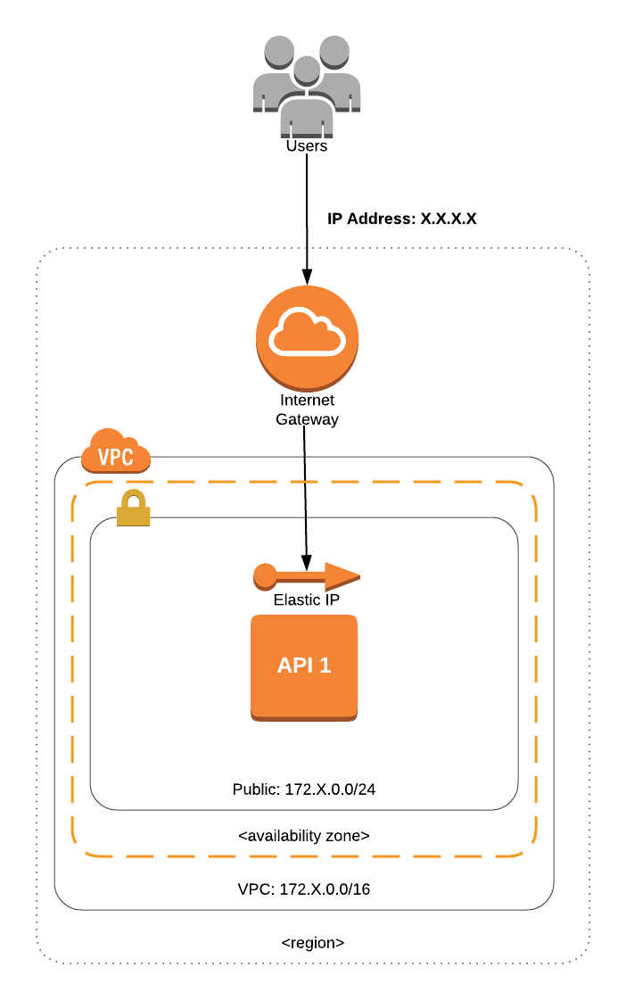

# Apphack Terraform Challenge
In this Terraform challenge, you will have to deploy a few infrastructure components to a major cloud provider: [Amazon Web Services](https://aws.amazon.com/). You do not need to be an expert on AWS in order to complete this workshop, as the focus is to learn Terraform. However, any experience in any of these tools will certainly be helpful.

In order to help you build the final solution, this challenge will have different stages. The more stages you go through, the more complex your infrastructure will become and the closer you will be to the final solution.

For this challenge, we will be using [Terraform](https://www.terraform.io/docs/index.html) **0.14.8**.

# FAQ

## I did not attend the Apphack workshop. How can I take this challenge?

To take this challenge, you will have to provision the same base infrastructure Slalom Build provided the attendees during the event. We may provide a tutorial for you to follow in this repo to provision your own base infrastructure if time allows.

## I heard there are later versions of Terraform coming out. Will we use them?

No, we'll proceed with version `0.14.8` for simplicity purposes at this time

# Getting started

You will not need to install Terraform, the AWS CLI or any other packages on your computers to complete this challenge. You will be provided with a virtual environment which already contains all the tools needed.

To get started, open up a web browser of your choice and navigate to https://284597760607.signin.aws.amazon.com/console?region=us-east-1. Use the team name and password we provided you with to fill in the values for `IAM user name` and `Password`, respectively, to sign in to the AWS console.

Once you have successfully signed in you'll be welcomed to the AWS Console Home page. From here you'll be able to discover over 150 AWS services, manage and monitor your cloud-based applications, and most importantly build your solution for this challenge. During this workshop you'll be charged to stand up a webpage using some resources we provided in this repository. To accomplish this we'll leverage one of the most simple, yet powerful of all AWS services - Amazon S3. Hosting a static website on Amazon S3 delivers a highly performant and scalable website at a fraction of the cost/effort of a traditional web server. In fact if you do enough digging, you'll be surprised at how many companies you find that use S3 in some capacity.

From the home page, use the search bar at the top to navigate to the AWS `Cloud9` service. There you will see an environment with a name that matches the team name you've been given; click on `Open IDE` to launch your personal Linux environment and begin the challenge.

# Stage 0

Now that you have opened the IDE feel free to familiarize yourself with layout. When you're ready please run a command at the bash prompt `git clone https://github.com/AppHackTF2021/apphack-workshop.git && cd apphack-workshop`
This will pull down our repo into your terminal and take you into the git repo you just pulled down.

This stage will get you familiar enough with Terraform so you can start building the solution in the next stages. **However, if you are already experienced in using Terraform, you can skip to Stage 1**.

First, utilize the Cloud9 workspace you located in the **Getting Started** section and create two files called **providers.tf** and  **outputs.tf** with the following content:

providers.tf
```
terraform {
  # This module is now only being tested with Terraform 0.14.x - we are setting
  # 0.14.1 as the minimum version
  required_version = ">= 0.14.1"
}

# The default provider configuration; resources that begin with `aws_` will use
# it as the default, and it can be referenced as `aws`.
provider "aws" {
  region = "us-east-1"
}
```

outputs.tf
```
# The simplest possible Terraform module: it just outputs "Hello, World!"
output "intro" {
  value = "Hello, World!"
}
```

Terraform template files have *.tf* extension. That's where you will define all the resources your infrastructure will have.
The provider block you defined in providers.tf will tell Terraform which plugins to download. In this case, Terraform will download the AWS plugin so it can make calls to the AWS API (Terraform does not use the AWS CLI to make API calls, it actually uses the [AWS Golang SDK](https://github.com/terraform-providers/terraform-provider-aws/tree/master/aws)).
The resource block (with syntax: *output "RESOURCE_NAME" {}*), on the other hand, is used to print or return values of a Terraform module, and has several uses. In this case, you will be creating a basic output as an example.

Once you finish output.tf, the first command you will run is *terraform init*:

```
$ terraform init

Initializing provider plugins...
- Checking for available provider plugins on https://releases.hashicorp.com...
- Downloading plugin for provider "aws" (1.28.0)...

The following providers do not have any version constraints in configuration,
so the latest version was installed.

To prevent automatic upgrades to new major versions that may contain breaking
changes, it is recommended to add version = "..." constraints to the
corresponding provider blocks in configuration, with the constraint strings
suggested below.

* provider.aws: version = "~> 1.28"

Terraform has been successfully initialized!

You may now begin working with Terraform. Try running "terraform plan" to see
any changes that are required for your infrastructure. All Terraform commands
should now work.

If you ever set or change modules or backend configuration for Terraform,
rerun this command to reinitialize your working directory. If you forget, other
commands will detect it and remind you to do so if necessary.
```

What *terraform init* does is it creates a directory called *.terraform* and downloads the AWS plugin. That means if you declare other providers, like GCP, *terraform init* will also download the GCP plugin.

You will also need to rerun *terraform init* whenever you:

* Declare a provider
* Declare a module
* Configure a remote backend

Next, let's see how we can perform a dry run. Run the following command:

```
$ terraform plan
Refreshing Terraform state in-memory prior to plan...
The refreshed state will be used to calculate this plan, but will not be
persisted to local or remote state storage.


------------------------------------------------------------------------

An execution plan has been generated and is shown below.
...

Note: You didn't specify an "-out" parameter to save this plan, so Terraform
can't guarantee that exactly these actions will be performed if
"terraform apply" is subsequently run.
```

The goal of Terraform plan is to tell you what will be created, modified or deleted. That's just so you are aware what will happen with your infrastructure before you go ahead and apply the changes.

Once you're happy with plan's output, run:

```
$ terraform apply
```

After you ran apply, Terraform created a file called *terraform.tfstate*. A [state file](https://www.terraform.io/docs/state/) contains state information about your managed infrastructure and configuration. If you cat terraform.tfstate, you will see the following:
```
$ cat terraform.tfstate
```

The state file keeps track of things like the Terraform version, the resources created, resource dependencies etc. When working in a bigger project, you do not want to store the state file locally. The best approach is to save this file in a remote storage (like S3). You will see how this is done as you progress in the challenge.

Let's destroy the infrastructure created:
```
$ terraform destroy
```
Now you're ready to begin the challenge. **Keep both files, but you may remove the hello_world block from outputs.tf if you wish**.

# Stage 1

## Architecture


In the first stage, you will launch a very basic AWS resource - an S3 bucket that will later serve a higher purpose. This is obviously far from a secure solution, but this is just the first step. You will need to define in your Terraform template files:

* Provider
* Generic S3 bucket resource
  * Use tags to name your resources and to identify your team as owner of the resource. For example, within each Terraform resource, declare a tags block (if the resource supports tags) with Name and Team keys:
* Outputs
  * Name of the bucket

main.tf
```
resource "aws_s3_bucket" "teambucket" {
  bucket = "apphack-team-X-bucket" // Update with the name of your team
  acl    = "private"

  tags = {
    Name = "yourName"
    Team = "Team X"
  }
}
```
Note: You'll need to replace the 'X' in this block to the actual team number you were assigned prior to beginning this challenge

To help you understand the output value you will need to complete Stage 2, take a look at the references below:

* [Terraform Outputs](https://www.terraform.io/docs/language/values/outputs.html)

## DoD (Definition of Done)

You will have completed the first Stage if you go to your web browser, navigate to the S3 service, and find your team's bucket exists. This means you have successfully deployed your team's S3 bucket.

# Stage 2

## Static Website Hosting

Next, we will be enabling the website hosting feature on the S3 bucket you created in the Stage 1. To do this you'll need to modify the existing `aws_s3_bucket` resource block and also create an additional `aws_s3_bucket_object` resource block. In the new resource block, you must define the following attributes

```
bucket
key
source
acl
content_type
```

To help you identify and understand all attribute values you will need to complete Stage 2, take a look at the references below:

* [S3 Bucket](https://registry.terraform.io/providers/hashicorp/aws/latest/docs/resources/s3_bucket#static-website-hosting)
* [S3 Bucket Object](https://registry.terraform.io/providers/hashicorp/aws/latest/docs/resources/s3_bucket_object)

If you are still in doubt how to organize all these resources in order to create the Stage 2 infrastructure, please reach out to one of the organizers.

## DoD (Definition of Done)

You will have completed the second Stage if you are able to navigate to the S3 Bucket URL that was generated as a result of your `terraform apply`

# Stage 3

## Simple Notification Service

Next up, SNS! In this stage you'll need to create two or four additional resource blocks - the actual number comes down to your choice in approach for achieving the goal. At a minimum you must create `aws_sns_topic` and `aws_sns_topic_subscription` resources. The topic you create must be assigned an AWS policy that grants explicit permissions to manage access around it. For this you may opt to include that policy directly in the `aws_sns_topic` block, or as separate `aws_sns_topic_policy` & `aws_iam_policy_document` blocks. Here's a list of the required attributes for this stage, along with the optional ones:

topic
```
name
policy (optional)
```

subscription
```
topic_arn
protocol
endpoint
endpoint_auto_confirms
```

topic policy (optional)
```
arn
policy
```

policy document
```
policy_id
statement {actions=[]}
condition {
  VAR = VAL
  values = [
    "..."
  ]
}
principals {
  type
  identifiers
}
resources = []
```

To help you identify all AWS resources you will need to complete Stage 3, take a look at the references below:

* [SNS Topic](https://registry.terraform.io/providers/hashicorp/aws/latest/docs/resources/sns_topic)
* [SNS Topic Policy](https://registry.terraform.io/providers/hashicorp/aws/latest/docs/resources/sns_topic_policy)
* [SNS Topic Subscription](https://registry.terraform.io/providers/hashicorp/aws/latest/docs/resources/sns_topic_subscription)

If you are still in doubt how to organize all these resources in order to create the Stage 3 infrastructure, please reach out to one of the organizers.

Note: We trust you not to spam other peoples' emails to troll. However if we catch you doing this we will kindly decommission your cloud9 environment

## DoD (Definition of Done)

You will have completed the third Stage if you are able to receive an email from the SNS Subscription you created as a result of your publishing a test message to your SNS Topic via the AWS Console.

# Stage 4

## S3 Bucket Notifications

For the final stage you'll need to create one more resource, an `aws_s3_bucket_notification`. With this resource in place, you'll automatically receive an email when something specific happens to your S3 bucket. For this workflow in particular, we'll choose to be notified every time a new file is uploaded to our S3 bucket; or in other words, every time an objects gets created in the bucket. In the new resource block, you must define the following attributes:

```
bucket
topic {
  topic_arn
  events
}
```

After you have successfully applied this resource, confirm its functionality by drag & dropping the `assets` and `images` (found in the `website/` directory of this repo) folders out of your Cloud9 environment, and into the root level of your S3 bucket.

To help you understand the AWS resource you will need to complete Stage 4, take a look at the reference below:

* [S3 Bucket Notification](https://registry.terraform.io/providers/hashicorp/aws/latest/docs/resources/s3_bucket_notification)

If you are still in doubt how to organize all these resources in order to create the Stage 4 infrastructure, please reach out to one of the organizers.

## DoD (Definition of Done)

You will have completed the forth Stage if you receive emails for all objects that get upload to your bucket and verify that graphics/styles appear on your landing page to display the finished product.

# Stage 5 (BONUS!)

## Variables and Organization

Since you have completed the challenge successfully, you earned a bonus stage!

One of the best practices when developing Terraform templates is to organize the files into separate components. Sometimes a Terraform workspace looks like:

```
main.tf
```

Where all the infrastructure is defined in main.tf. This is similar to developing an entire API using a single file. It's not scalable. On the other hand, some workspaces might look like:

```
network.tf
api.tf
database.tf
main.tf
```

This is a better approach since the infrastructure is being split into components. Here's what you will have to do in Stage 6. First, restructure your workspace to look like the following:

```
.
├── main.tf
├── variables.tf
├── provider.tf
├── outputs.tf
└── terraform.tfvars
```

Whenever you use a variable (with the syntax "${var.XXXX}"), you need to declare this variable (**variable "XXXX" {}**) either in the same or in a different .tf file (where the variable is declared doesn't matter as Terraform loads all .tf files). This means you could potentially declare *bucket_name* and *topic_name* in main.tf, but when the number of variables starts to increase, it's cleaner to put them in a separate file.

### Ok, but what about terraform.tfvars? What is that for?

If you take a look at the main.tf you built, you will notice that all of the attribute values were hardcoded. What if you want to use these values somewhere else in main.tf? It's certainly not advisable that you keep copying and pasting. So, variables to the rescue!

The same way that we made bucket_name and topic_name static values previously, we will make them variables in main.tf now:

```
variable "bucket_name"    {}
variable "topic_name" {}


resource "aws_s3_bucket" "teambucket" {
  bucket = "${var.bucket_name}"
  acl    = "private"
}

resource "aws_sns_topic" "test" {
  name = "${var.topic_name}"
}
```

(You declared the variables in main.tf. Can I declare them in a separate file called variables.tf? **Yes**).

Now that bucket_name and topic_name are variables for the main template file, we need to write their value somewhere. There are three main options that can help you achieve that. If you leave your workspace as is (without a **terraform.tfvars** file), whenever you run **terraform plan**, Terraform will ask you for the value of these two variables. The second option is to provide the value of these variables via cli:

```
terraform plan -var "bucket_name=AAAAAAAA" -var "topic_name=BBBBBBBB"
```

But for a large number of variables, it'd be a tedious job to declare them all via cli. The third and best option is to write the values in a file which Terraform will read. That's **terraform.tfvars**. The syntax of a terraform.tfvars is simple:

```
bucket_name = "AAAAAAAA"
topic_name = "BBBBBBBB"
```

It's simply key-value pairs. Now whenever you do terraform plan, you will not be asked for variable values.

PS: terraform.tfvars is a special name which Terraform knows about. If you call it something else (e.g., infrastructure.tfvars), you will need to tell Terraform which file to look at by using the cli option **-var-file**:

```
terraform plan -var-file=infrastructure.tfvars
```

Hopefully that will help you restructure your workspace following best practices. As always, let one of the organizers know if you have any issues.

## DoD (Definition of Done)

Same as Stage 4.

### Good luck to all teams!
